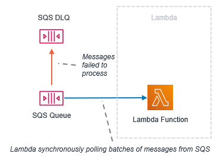
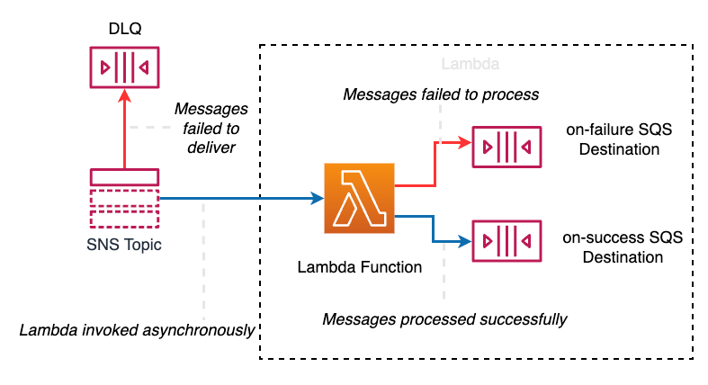
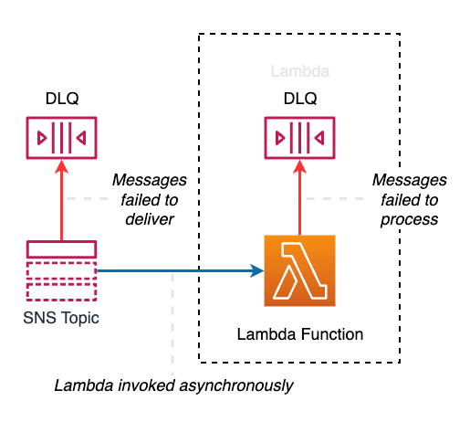

# Welcome to the AWS Lambda error handling patterns CDK Python project!
Event-driven architectures are an architecture style that can help you boost agility and build reliable, scalable applications. Splitting an application into loosely coupled services can help each service scale independently. A distributed, loosely coupled application depends on events to communicate application change states. Each service consumes events from other services and emits events to notify other services of state changes. 

Handling errors becomes even more important when designing distributed applications. A service may fail if it cannot handle an invalid payload, dependent resources may be unavailable, or the service may time out. There may be permission errors which can cause failures. AWS services provide many features to handle error conditions which you can use to improve the resiliency of your applications.

This repository explores three use-cases and design patterns for handling failures

The `cdk.json` file tells the CDK Toolkit how to execute your app.

This project is set up like a standard Python project. The initialization
process also creates a virtualenv within this project, stored under the `.venv`
directory. To create the virtualenv it assumes that there is a `python3`
(or `python` for Windows) executable in your path with access to the `venv`
package. If for any reason the automatic creation of the virtualenv fails,
you can create the virtualenv manually.

# Create Environment

To manually create a virtualenv on MacOS and Linux:

```
$ python3 -m venv .venv
```

After the init process completes and the virtualenv is created, you can use the following
step to activate your virtualenv.

```
$ source .venv/bin/activate
```

If you are a Windows platform, you would activate the virtualenv like this:

```
% .venv\Scripts\activate.bat
```

Once the virtualenv is activated, you can install the required dependencies.

```
$ pip install -r requirements.txt
```

At this point you can now synthesize the CloudFormation template for this code.

```
$ cdk synth 
```

To add additional dependencies, for example other CDK libraries, just add
them to your `setup.py` file and rerun the `pip install -r requirements.txt`
command.

# Design pattern using SQS DLQ.

When using Lambda with SQS, if Lambda isn’t able to process the message and the message retention
period expires, SQS drops the message. Failure to process the message can be due to function 
processing failures, including time-outs or invalid payloads. Processing failures can also 
occur when the destination function does not exist, or has incorrect permissions.

You can configure a separate [dead-letter queue (DLQ)][1] on the source queue for SQS to retain 
the dropped message. A DLQ preserves the original message and is useful for analyzing root 
causes, handling error conditions properly, or sending notifications that require manual 
interventions. In the poll-based invocation scenario, the Lambda function itself does not 
maintain a DLQ. It relies on the external DLQ configured in SQS. For more information, 
see [Using Lambda with Amazon SQS][2].

The following shows the design pattern when you configure Lambda to poll events from a SQS queue and invoke a Lambda function. 



# Design pattern using Lambda Destination.





# Design pattern using Lambda DLQ.


Enjoy!

[1]: https://en.wikipedia.org/wiki/Dead_letter_queue
[2]: https://docs.aws.amazon.com/lambda/latest/dg/with-sqs.html
