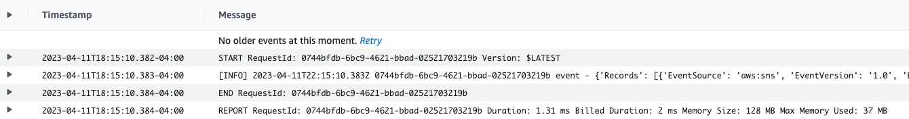
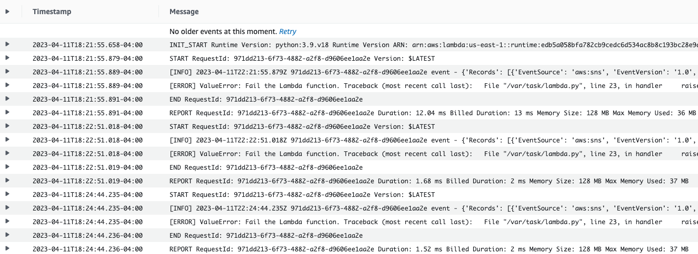

# Welcome to the AWS Lambda error handling patterns CDK Python project!

This document describes the steps for testing the Lambda asynchronous invocation using DLQ.

## Create stack
$ cdk deploy LambdaDlqStack

## Delete stack
$ cdk destroy LambdaDlqStack

## Test Happy Path

* Test the Lambda function happy path processing an event from the SNS topic successfully. 
* The function logs the successful result to CloudWatch Logs. 




## Test Unhappy Path

* Test the Lambda function unhappy path by sending a negative event to the SNS topic that has the data field “pass” set to false. 
* The functions throw an exception. The CloudWatch log messages show how the function retried processing the event three times and failed to complete. 

* Lambda also sends the unsuccessfully processed event to the function DLQ. 
```commandline
    "Messages": [
        {
            "MessageId": "8e50b8cb-ba5f-4e7b-8d9f-4a0bfd5b98e4",
            "ReceiptHandle": "…",
            "MD5OfBody": "…",
            "Body": "…",
            "MD5OfMessageAttributes":"…",
            "MessageAttributes": {
                "ErrorCode": {
                    "StringValue": "200",
                    "DataType": "Number"
                },
                "ErrorMessage": {
                    "StringValue": "Fail the Lambda function.",
                    "DataType": "String"
                },
                "RequestID": {
                    "StringValue": "…",
                    "DataType": "String"
                }
            }
        }
    ]
```
* You can also test the same unhappy path where SNS is unable to deliver an event to the Lambda service due to a permissions issue. 

Enjoy!
