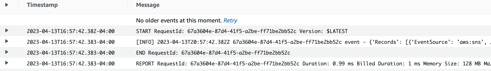
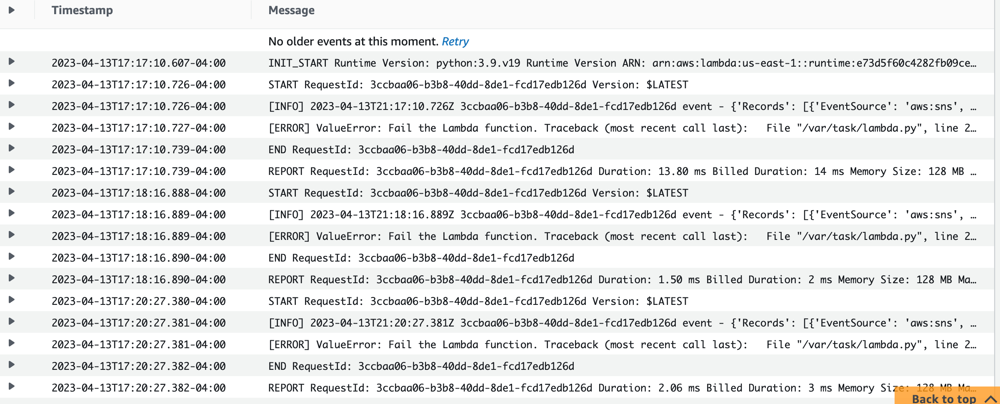

# Welcome to the AWS Lambda error handling patterns CDK Python project!

This document describes the steps for testing the Lambda asynchronous invocation using both DLQ and Lambda destinations.

## Create stack
$ cdk deploy LambdaDestinationDlqStack

## Delete stack
$ cdk destroy LambdaDestinationDlqStack

## Test Happy Path

* Test the Lambda function happy path processing an event from the SNS topic successfully.
* The function logs the successful result to CloudWatch. 
* Lambda also saves the successfully processed event to the on-success SQS destination.




## Test Unhappy Path

* The Lambda function unhappy path processing an event from the SNS topic. 
* The CloudWatch log messages show how the function retried processing the event three times and failed to complete.
* Lambda also saves the unsuccessfully processed event and the execution result to the on-failure SQS destination.
```commandline
	"Messages": [
		{
			"MessageId": "8bd40bc4-b588-4b84-afe1-a54782481ebd",
			"ReceiptHandle": "…",
			"MD5OfBody": "550becd66e73be96cdcb5cf4b1acb123",
			"Body": “… \"condition\":\"RetriesExhausted\",\"approximateInvokeCount\":3},\"requestPayload\":{\"Records\":[{\"EventSource\":\"aws:sns\",\"EventVersion\":\"1.0\",…\"Sns\":{\"Type\":\"Notification\",\"MessageId\":\"fc8434a3-3695-5506-8fa7-6811450313c3\",\"TopicArn\":\"arn:aws:sns:us-east-1:461213412269:lambda_topic\",\"Subject\":null,\"Message\":\"{\\\"pass\\\": false}\",\"Timestamp\":\"2023-04-13T21:17:10.330Z\",… \"responseContext\":{\"statusCode\":200,\"executedVersion\":\"$LATEST\",\"functionError\":\"Unhandled\"},\"responsePayload\":{\"errorMessage\": \"Fail the Lambda function.\", \"errorType\": \"ValueError\", \"requestId\": \"3ccbaa06-b3b8-40dd-8de1-fcd17edb126d\", \"stackTrace\": [\"  File \\\"/var/task/lambda.py\\\", line 23, in handler\\n    raise ValueError(\\\"Fail the Lambda function.\\\")\\n\"]}}"
		}
	]
```
* In addition to the original event, the message contains the error message, error type, and stack trace in the response payload section.

* You can also test the unhappy path is where SNS unable to deliver an event to the Lambda service. You manually disable the resource policy of the Lambda function to simulate a permission issue, which causes SNS to send the event to its configured DLQ.

Enjoy!
