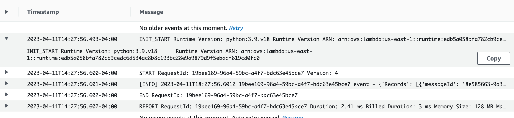

# Welcome to the AWS Lambda error handling patterns CDK Python project!

This document describes the steps for testing the Lambda poll-based invocation pattern.

## Create Stack

$ cdk deploy SQSDLQStack

## Delete stack
$ cdk destroy SQSDLQStack

## Testing Happy Path

* Test the Lambda function happy path processing an event from the SQS queue successfully. 
* The function logs the successful results to Amazon CloudWatch.

## Testing Unhappy Path

* Test the Lambda function unhappy path by throwing an exception while processing an event from the SQS queue. 
* The CloudWatch log messages show how the function retried processing the event three times and failed to complete.
* SQS send failed message to the DLQ. 

Enjoy!

[1]: https://en.wikipedia.org/wiki/Dead_letter_queue
[2]: https://docs.aws.amazon.com/lambda/latest/dg/with-sqs.html
